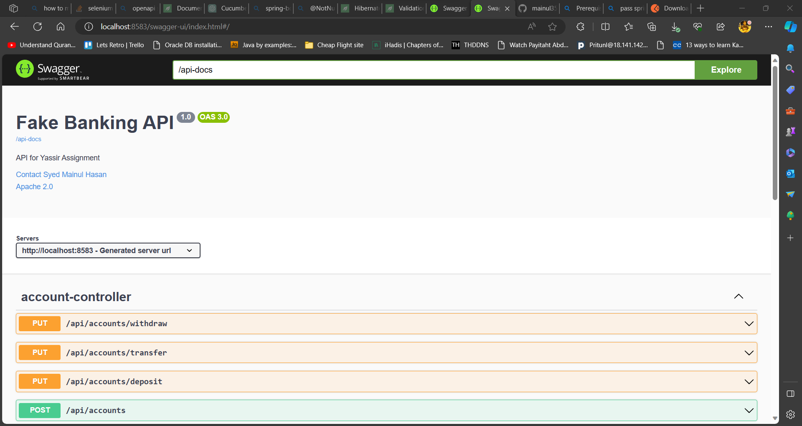
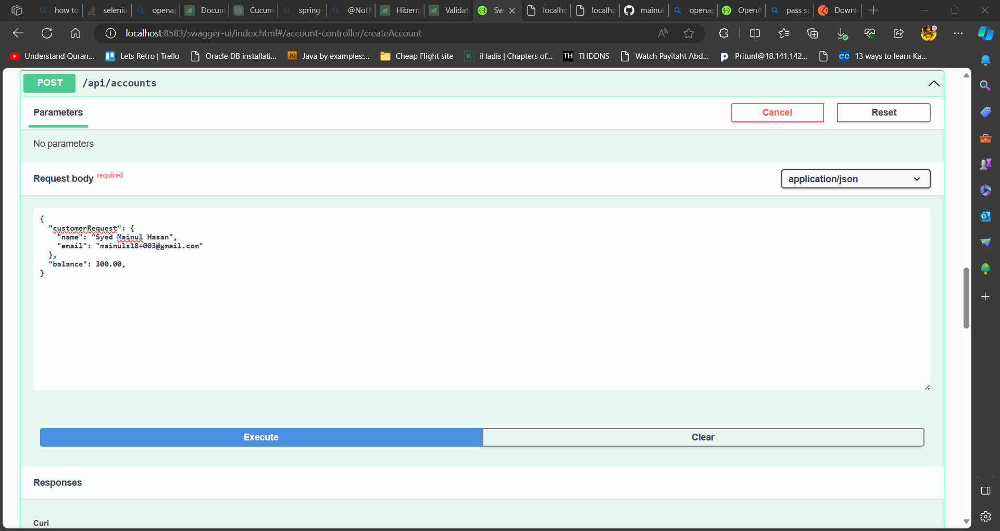
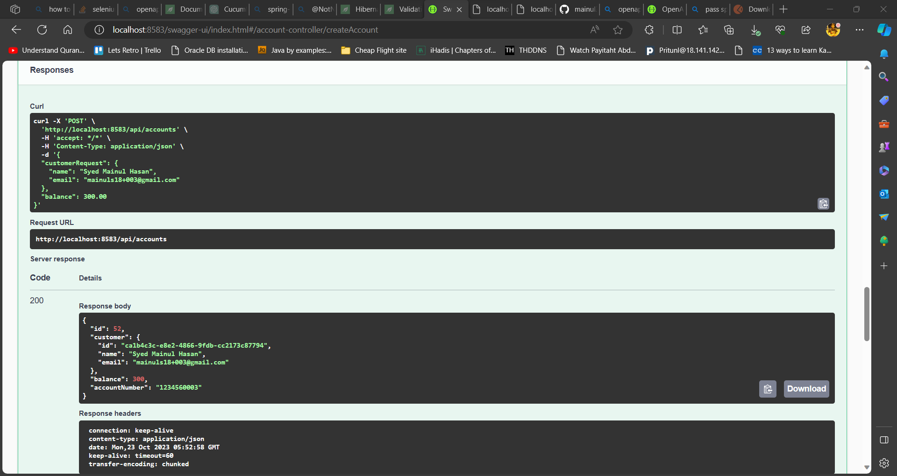
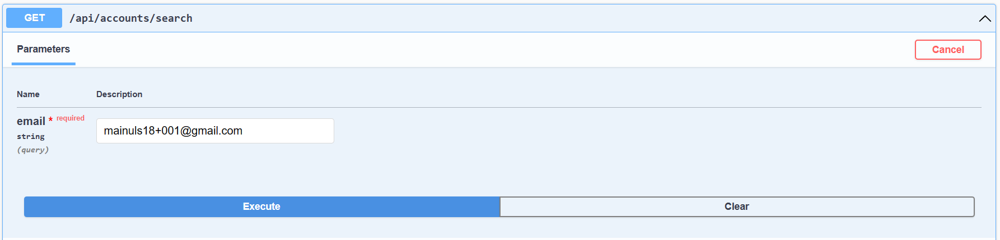

# Documentation
## Runtime Version
JDK 17

Spring Boot 3.1.5

Maven  3.9.5

Docker version 24.0.6

Docker Compose version v2.22.x

### ERD


## How to run

### Start database with Docker Compose
Prerequisite: Must have docker-compose installed on the machine.

Go to ``/infra/docker-compose`` folder inside the project root. Run with command `docker-compose up`

### Run cucumber tests

Open terminal or command line and run command ``mvn clean test "-Dspring.profiles.active=test"`` from the directory where `pom.xml` is located.

### Make jar package

From terminal or command line run command ``mvn clean install "-Dspring.profiles.active=test"`` from the directory where `pom.xml` is located. This will create a jar file in the `/target/` directory.

### Run the jar file

Move to the `/target/` directory and from terminal or command line run command run ``java "-Dspring.profiles.active=dev" -jar .\fake-banking-api-0.0.1-SNAPSHOT.jar``.

It will run the application on port `8583`

### Open Swagger UI
Go to http://localhost:8583/swagger-ui/index.html from your browser to open SwaggerUI.



### Create a new customer account

The following endpoint first creates a new customer, then creates a new account for the newly created customer. 

**Request Method:** POST

**Endpoint:** /api/accounts/create

**Request Object**

```
{
  "customerRequest": {
    "name": "Syed Mainul Hasan",
    "email": "mainuls18+003@gmail.com"
  },
  "balance": 300.00,
}
```
Note: Don't provide customer ID or Account number value for this endpoint.




**Response Object:**

```
{
  "id": 52,
  "customer": {
    "id": "ca1b4c3c-e8e2-4866-9fdb-cc2173c87794",
    "name": "Syed Mainul Hasan",
    "email": "mainuls18+003@gmail.com"
  },
  "balance": 300,
  "accountNumber": "1234560003"
}
```


### Search customer account
**Request Method:** GET

**Endpoint:** /api/accounts/search?email={your_mail}

**Query Parameter**

email



**Response Object:**

```
[
  {
    "id": 1,
    "customer": {
      "id": "67d727c0-9d94-4225-a80e-e530ae49e62f",
      "name": "Syed Mainul Hasan",
      "email": "mainuls18+001@gmail.com"
    },
    "balance": 423.73,
    "accountNumber": "1234560001"
  }
]
```


### Create a new customer account for existing customer

The following endpoint looks for an existing customer, then creates a new account for the existing customer. 
One customer can have multiple accounts. 
For this purpose this endpoint is created.

**Request Method:** POST

**Endpoint:** /api/accounts/create/{customerId}

**Request Object**

```
{
  "initBalance": 300.00
}
```


**Response Object:**

```
{
  "id": 102,
  "customer": {
    "id": "67d727c0-9d94-4225-a80e-e530ae49e62f",
    "name": "Syed Mainul Hasan",
    "email": "mainuls18+001@gmail.com"
  },
  "balance": 300,
  "accountNumber": "1234560004"
}
```


### Deposit

**Request Method:** PUT

**Endpoint:** /api/accounts/deposit

**Request Object**

```
{
  "accountNumber": "1234560001",
  "amount": 200.247
}
```


**Response Object**

```
{
  "transactionId": "8a69343d-5bd8-4483-a2c3-ef36e4390330"
}
```


### Withdraw

**Request Method:** PUT

**Endpoint:** /api/accounts/withdraw

**Request Object**

```
{
  "accountNumber": "1234560001",
  "amount": 25.777
}
```


**Response Object**

```
{
  "transactionId": "6631cd53-d61f-4b29-ab94-71a6178c18a7"
}
```


### Transfer to accounts of different owners

**Request Method:** PUT

**Endpoint:** /api/accounts/transfer

**Request Object**

```
{
  "fromAccount": "1234560001",
  "toAccount": "1234560002",
  "amount": 20.432
}
```


**Response Object**

```
{
  "transactionId": "dee20fe4-052c-4e63-bb76-763fe7bd4d6d"
}
```


### Transfer to accounts of same owner

**Request Method:** PUT

**Endpoint:** /api/accounts/transfer

**Request Object**

```
{
  "fromAccount": "1234560004",
  "toAccount": "1234560001",
  "amount": 33.213
}
```


**Response Object**

```
{
  "transactionId": "7041f33e-da75-4f89-a31a-9481e1837e0e"
}
```


### Transaction history for an account

**Request Method:** GET

**Endpoint:** /api/transaction/{accountNumber}


**Response Object**

```
[
  {
    "fromAccount": null,
    "toAccount": "1234560001",
    "amount": 300,
    "newBalance": 300,
    "txnType": "DEPOSIT",
    "txnRef": "45bfe291-b799-4765-899a-94c4597a6ced",
    "createdAt": "2023-10-23T04:35:46.68912Z"
  },
  {
    "fromAccount": null,
    "toAccount": "1234560001",
    "amount": 200.25,
    "newBalance": 500.25,
    "txnType": "DEPOSIT",
    "txnRef": "8a69343d-5bd8-4483-a2c3-ef36e4390330",
    "createdAt": "2023-10-23T04:42:27.501724Z"
  },
  {
    "fromAccount": "1234560001",
    "toAccount": "1234560002",
    "amount": 20.43,
    "newBalance": 479.82,
    "txnType": "TRANSFER",
    "txnRef": "dee20fe4-052c-4e63-bb76-763fe7bd4d6d",
    "createdAt": "2023-10-23T04:42:59.736675Z"
  },
  {
    "fromAccount": "1234560001",
    "toAccount": null,
    "amount": 30.31,
    "newBalance": 449.51,
    "txnType": "WITHDRAW",
    "txnRef": "becbc144-93bc-4ddc-b9ab-4f0abe816f8a",
    "createdAt": "2023-10-23T04:44:22.03786Z"
  },
  {
    "fromAccount": "1234560001",
    "toAccount": null,
    "amount": 25.78,
    "newBalance": 423.73,
    "txnType": "WITHDRAW",
    "txnRef": "6631cd53-d61f-4b29-ab94-71a6178c18a7",
    "createdAt": "2023-10-23T04:59:38.162312Z"
  },
  {
    "fromAccount": "1234560004",
    "toAccount": "1234560001",
    "amount": 33.21,
    "newBalance": 456.94,
    "txnType": "DEPOSIT",
    "txnRef": "7041f33e-da75-4f89-a31a-9481e1837e0e",
    "createdAt": "2023-10-23T06:55:01.504236Z"
  }
]
```


